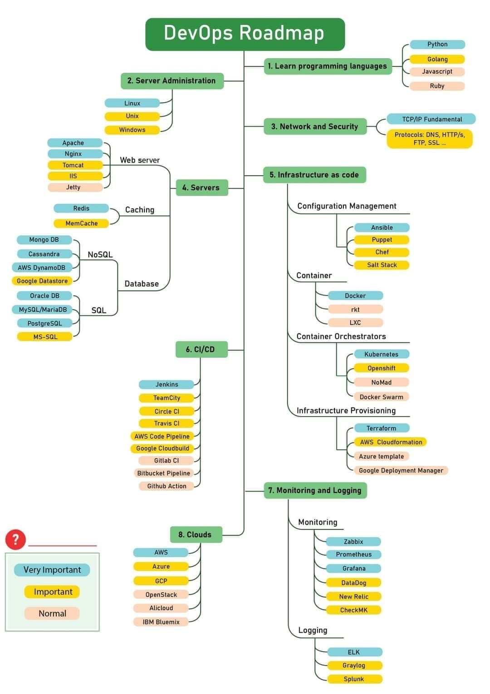

<h3 align="center">DevOps roadmap</h3>

This roadmap will demonstrate my DevOps skills.

### Content:

* [Disclaimer ⚠️](#disclaimer-)
* [Idea 💡](#idea-)
* [Roadmap 📈](#roadmap-)
* [Goals 🏃](#goals-)

### ⚠️Disclaimer ⚠️

I'm not pretending to be a professional programmer and moreover DevOps specialist.

### Idea 💡:

The idea becomes to me when I've realized that DevOps skills are a big part of programming. For my projects, I had to
configure a server infrastructure, deploy, manage, and monitor my real projects such as bot for an insurance company.
For my amateur projects, I had to set up CI/CD in Github/GitLab repos, so I decided to create this repository, and
demonstrate my road to good DevOps and a good programmer.

### Roadmap 📈:

  

### Goals 🏃:

#### Signs ✍️:

* ✅ - Learned
* ❌ - Not learned
* ⚠️- 50/50
* 🔄 - In progress

#### Branches 🌳:

1. Learn programming languages:
    * Python ✅
    * Golang ❌
    * Javascript ✅

2. Server Administration
    * Linux 🔄
    * Windows ❌

3. Network and Security
    * TCP/IP Fundamental ✅
    * DNS, HTTP/s, FTP, SSL, SSH ✅

4. Servers
    * Web server
        * Apache ❌
        * Nginx ✅
    * Caching
        * Redis ⚠️
        * MemCache ⚠️
    * Database
        * NoSQL
            * Mongo DB ❌
            * Cassandra ❌
            * AWS DynamoDB ❌
            * Google Datastore ❌
        * SQL
            * Oracle DB ❌
            * MySQL ❌
            * MariaDB ❌
            * PostgreSQL ✅

5. Infrastructure as code
    * Configuration Management
        * Ansible ❌
    * Container
        * Docker ✅
    * Container Orchestrators
        * Kubernetes ❌
    * Infrastructure Provisioning
        * Terraform ❌
        * AWS Cloudformation ❌

6. CI/CD
    * Jenkins ❌
    * TeamCity ❌
    * Circle CI ❌
    * Travis CI ❌
    * AWS Code Pipeline ❌
    * Google Cloudbuild ❌
    * Gitlab CI ✅
    * Github Action ❌

7. Monitoring and Logging
    * Monitoring
        * Zabbix ❌
        * Prometheus ❌
        * Grafana ❌
    * Logging
        * ELK ❌

8. Clouds
    * AWS ❌
    * Azure ❌
    * GCP ⚠️